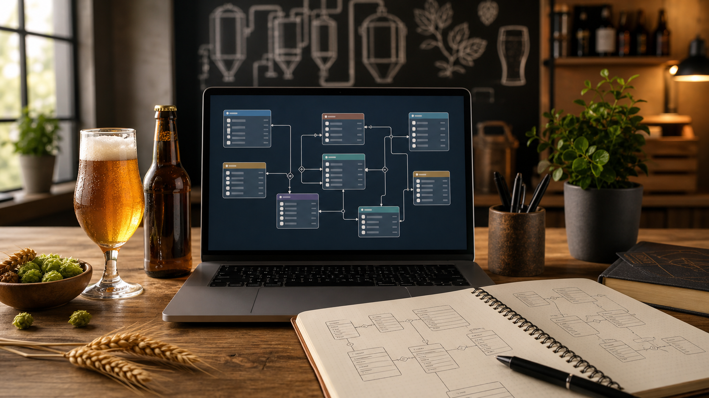

# Zythologue



Base de données d'une application dédiée aux amateurs de bières artisanales.
Le projet couvre la modélisation MERISE (MCD, MLD, MPD) puis l'implémentation
sous PostgreSQL avec les scripts de création, d'alimentation et les requêtes
demandées.

## API (backend)

La documentation de l'API REST (services CRUD sur les bières) est dans
[docs/api.md](docs/api.md).

## Stack

- PostgreSQL 18 (via Docker)
- Node.js / Express pour l'API
- `pg` pour connecter l'API à PostgreSQL
- DBeaver pour se connecter et exécuter les scripts

## Lancer avec Docker

Le `docker-compose.yml` lance la base PostgreSQL et l'API.
Depuis la racine du projet :

```bash
docker compose up -d
```

Pour vérifier qu'elle tourne :

```bash
docker compose ps
```

L'API écoute sur `http://localhost:3000` par défaut.
Si le port 3000 est déjà pris, on peut changer `API_PORT` dans le `.env`
ou lancer comme ça :

```bash
API_PORT=3001 docker compose up -d --build
```

Pour l'arrêter sans perdre les données :

```bash
docker compose stop
```

Les identifiants sont dans `.env` (un exemple est fourni dans `.env.example`).
Par défaut : base, utilisateur et mot de passe = `zythologue`, port `5432`.

Si le port 5432 est déjà occupé sur ta machine (par exemple par une autre
installation de PostgreSQL), change `POSTGRES_PORT` dans le `.env`, par exemple
en `5433`, puis relance `docker compose up -d`.

## Lancer l'API sans Docker

On peut aussi lancer seulement PostgreSQL avec Docker, puis l'API directement
sur la machine :

```bash
npm install
npm run dev
```

Dans ce cas, la connexion PostgreSQL utilise les variables du `.env`.

## Se connecter avec DBeaver

Nouvelle connexion PostgreSQL avec :

- Host : `localhost`
- Port : `5432` (ou celui défini dans `.env`)
- Base : `zythologue`
- Utilisateur : `zythologue`
- Mot de passe : `zythologue`

Au premier essai, DBeaver propose de télécharger le driver PostgreSQL,
il faut l'accepter.

## Exécuter les scripts

Les scripts sont dans le dossier `sql/` et se lancent dans cet ordre :

1. `01_create_schema.sql` — crée les tables et leurs contraintes
2. `02_seed.sql` — insère les données de test
3. `03_queries.sql` — les requêtes demandées

Ils sont rejouables : on peut les relancer sans erreur. Le schéma supprime les
tables avant de les recréer, et le seed vide les tables avant de réinsérer.

## Organisation du dépôt

```
docs/    modélisation (analyse, règles de gestion, dictionnaire, MCD, MLD, MPD)
sql/     scripts SQL
src/     API Express
img/     image du README
docker-compose.yml
Dockerfile
```

## Hypothèses de modélisation

Les principaux choix de conception, détaillés dans `docs/regles-gestion.md` :

- Une bière est rattachée à une seule brasserie et à une seule catégorie, les
  deux obligatoires. Une bière sans origine ni style n'aurait pas de sens, et
  rendre la catégorie obligatoire fiabilise le comptage des bières par catégorie.
- L'avis (note et commentaire) est une table à part entière, avec une
  contrainte d'unicité sur le couple utilisateur/bière : un utilisateur ne peut
  laisser qu'un seul avis par bière.
- Les favoris et la composition en ingrédients sont des tables de liaison, avec
  une clé primaire composée pour éviter les doublons.
- Supprimer une bière supprime aussi ses photos, ses avis et ses favoris, qui
  n'existent pas sans elle. À l'inverse, on ne peut pas supprimer une brasserie
  ou une catégorie encore utilisée, pour ne pas créer de bières orphelines.
